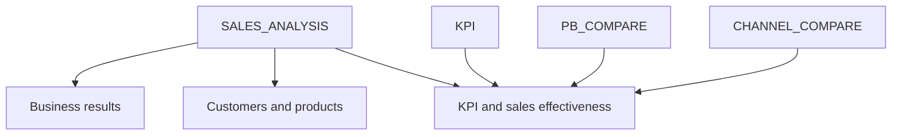

# Insurance Business Intelligence with Tableau
### Data Explorers 2026 · Team Serendipity · Data storytelling

A team dashboard project connecting insurance sales, customer and product analysis, and KPI performance to management questions.

**My contribution:** data cleaning and modeling, coordination of task allocation, and structuring the presentation content.

[Dashboard walkthrough](DASHBOARD_GUIDE.md) · [Metric definitions](METRICS.md) · [Evidence & review](EVIDENCE.md) · [Back to my profile](../../README.md)

## Business context

The competition brief describes an insurance business with two subsidiaries selling personal and motor insurance through channels such as bancassurance, agents, direct sales, and garages. Management needs a consistent way to understand sales, identify cross-selling opportunities, and compare performance against targets.

The team used Tableau to organize those questions into three dashboard pages.

## The workbook at a glance

| Inspected component | Count |
| --- | ---: |
| Dashboards | 3 |
| Worksheets | 26 |
| Business data sources | 4 |
| Calculated columns defined in business data sources | 73 |
| Parameters | 2 |

These counts come from the supplied workbook's XML definition. They describe the team artifact, not the number of components I personally implemented.

## Three views of the business

| Page | Management question | Views in the workbook | Intended use |
| --- | --- | --- | --- |
| **Business results** | Where does premium revenue come from? | Premium totals, contract/customer counts, average premium, renewal share, trends, channels, and product groups | Start with the overall picture, then locate the segments to investigate |
| **Customers & products** | Which customer and product segments deserve attention? | Age groups, customer tiers, product packages, customer profiles, and an asset-value/premium quadrant | Explore product mix and potential follow-up opportunities |
| **KPI & sales effectiveness** | Where is performance below target? | Actual versus target, channel gaps, department rankings, coverage, and a sales volume/value matrix | Prioritize management review and coaching |

These are the questions supported by the workbook design. No revenue uplift, improved retention, or deployed business outcome is claimed.

## How the pages connect to the data

The diagram reflects data-source references in the worksheets placed on each dashboard. It is a dependency map, not a reconstruction of the raw-data join schema.



The sales source references contracts, customers, products, channels, staff, branches, and motor-vehicle information. Separate sources support targets and comparisons by department and channel.

## My role

I contributed to cleaning and modeling the data, helped coordinate team tasks, and structured the presentation. The workbook and its calculated fields are shared team work; I do not claim to have independently built all dashboards or calculations.

The project gave me practice connecting a business question to the right data grain, metric, and presentation sequence.

## A useful metric distinction

The workbook's **renewal share** is:

```text
distinct contracts marked as renewal / all distinct contracts
```

This describes the mix of contracts in the selected scope. A customer-retention rate would require a defined cohort eligible to renew and a follow-up period. Keeping those definitions separate prevents a dashboard label from overstating what the data measures.

See [metric definitions](METRICS.md) for formulas and [review findings](EVIDENCE.md) for label and threshold issues identified while preparing this portfolio.

## Public portfolio scope

The competition brief prohibits redistribution of the supplied data. This case study therefore shares the business framing, workbook structure, and selected calculation logic. The packaged workbook and its embedded Hyper extracts are not published here.

The workbook was inspected structurally; it has not been opened and tested interactively in Tableau during this portfolio review. This page is a documented case study, not a live dashboard demo.
