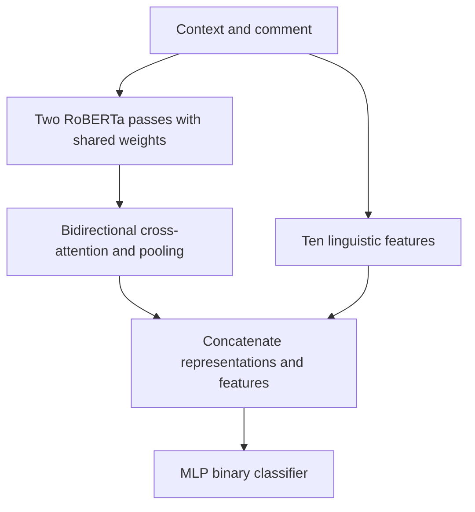

# Methods and evaluation

The descriptions below come from `NLP PJ.pdf` and `Report.docx`. They document the team's experiment; source-code behavior and training results have not been independently reproduced.

## Input and preprocessing

Each example pairs a parent context with a comment and a binary sarcasm label. The reports describe URL/HTML removal, whitespace normalization, removal of deleted/removed placeholders, and filtering of empty text. Capitalization and punctuation are retained. The Transformer tokenizer handles subword segmentation.

The experiment uses a balanced sample and a stratified train/validation/test split. The report describes removing test comments duplicated in training. Removing duplicates addresses direct content overlap, but does not by itself resolve overlap in authors, conversation threads, or communities.

## Classical and Transformer baselines

The classical input concatenates context and comment with a separator. TF-IDF uses unigrams and bigrams, sublinear term frequency, and a capped vocabulary; Logistic Regression and Linear SVM provide comparison baselines.

For the Transformer baseline, the report names `cardiffnlp/twitter-roberta-base-irony` as the starting checkpoint and states that the two-class classification head was reinitialized. Context and comment enter together as a RoBERTa text pair. The documented setup uses a maximum input length of 128 tokens and selects the checkpoint by validation F1.

This baseline uses **self-attention over the combined sequence**. Its tokens can interact across the context/comment boundary; that is distinct from the additional bidirectional cross-attention module in the experimental architecture.

## Experimental architecture

The report describes two input passes with shared encoder weights. It averages the final four hidden layers, applies bidirectional cross-attention, pools each side with mean and max pooling, and concatenates the representations with ten handcrafted features before an MLP classifier.

This is a schematic redrawn from the reported method, not an exported execution graph. The documented configuration uses eight attention heads, mean/max pooling, dropout, and separate learning rates for the pretrained backbone and newly initialized modules. Without source code, details such as attention masks and feature normalization cannot be verified here.

## Handcrafted features

| Feature | Signal described in the report |
| --- | --- |
| `f_overlap` | Shared words between context and comment |
| `f_sent_comment` | Comment sentiment using VADER |
| `f_sent_context` | Context sentiment using VADER |
| `f_sent_contrast` | Sentiment difference between the two texts |
| `f_length_ratio` | Relative comment/context length |
| `f_agreement` | Agreement markers |
| `f_intensifier` | Intensifying language |
| `f_caps_ratio` | Uppercase-word proportion |
| `f_is_question` | Final question mark |
| `f_polarity_flip` | Co-occurring positive and negative signals |

These are descriptive feature definitions, not sufficient specifications to reproduce the original extractor. The public case study does not infer missing formulas, marker lists, or normalization choices.

## Metrics and model selection

The reports compare accuracy, precision, recall, F1, and ROC-AUC, and discuss validation-based checkpoint selection. The Word report also describes choosing a classification threshold on validation data and then applying it to the test set; this changes the precision/recall trade-off.

A bootstrap analysis is reported for the F1 difference between the experimental architecture and RoBERTa. The reported interval includes zero, so the appropriate conclusion is that the experiment did not establish an improvement. It does not prove equal performance, establish deployment reliability, or account for every source of variability. Resampling predictions from one trained run does not measure variation across training seeds.

No prediction-level files or training notebook were supplied, so the resampling implementation, sample alignment, metric averaging convention, and statistical calculations have not been checked here.

## Error analysis and interpretation

The reports distinguish false positives caused by surface markers or rhetorical questions from false negatives involving understated sarcasm and short comments. They also discuss community knowledge, cultural references, and ambiguous labels as explanations for representative errors.

These explanations are hypotheses supported by qualitative inspection. They are not causal proof that a specific model component is responsible. Cross-attention connects the supplied texts; it does not introduce external facts that neither text contains. Component ablations would help separate the effects of attention, handcrafted features, and pooling.

## Evaluation boundaries

- **Author and community overlap:** the random split does not establish performance on unseen authors or communities. Overlap is a generalization concern; it is not by itself proof of label leakage or a quantified performance inflation.
- **Test-informed iteration:** the report uses baseline test errors to motivate the next architecture. A future study should use validation errors for development and retain a fresh untouched test set for the final comparison.
- **Proxy labels:** self-annotation is an imperfect indicator of sarcasm; ambiguous examples need careful interpretation.
- **Class balance:** results from a balanced sample do not establish precision under a different real-world class distribution.
- **Ablations and new domains:** complete component ablations and out-of-domain evaluation are proposed rather than demonstrated in the supplied material.

This portfolio therefore describes a team academic experiment and its lessons, without claiming a production service, cross-domain robustness, or a new benchmark reproduction.
